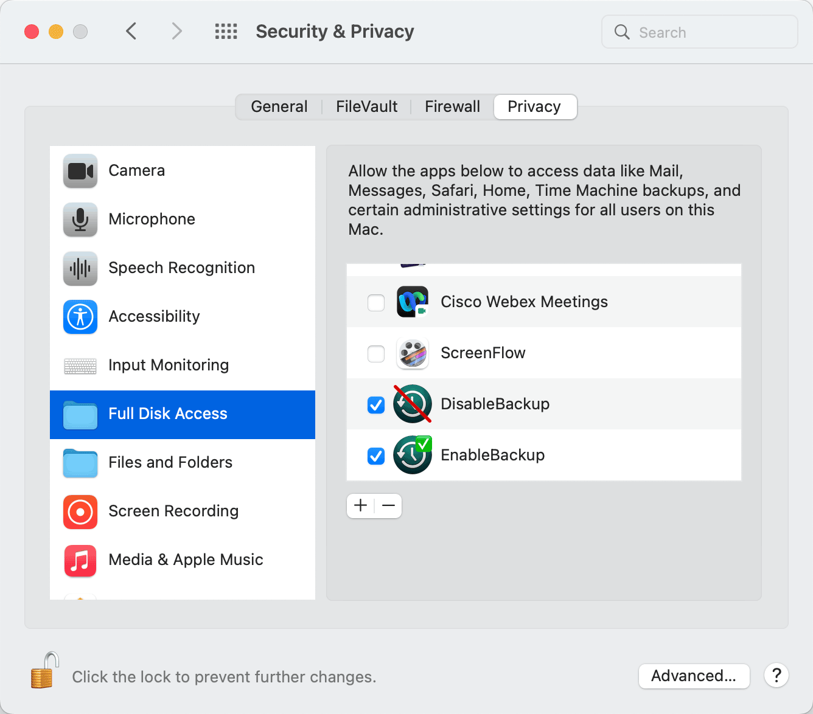

# Disable/Enable Backup

These apps disable and enable Time Machine backups.
When you run the apps, they execute the following commands and terminate.

*DisableBackup:*

- tmutil stopbackup
- tmutil disable

*EnableBackup:*

- tmutil enable

There is no UI. Confirm whether they work by going to Time Machine in your System Settings/Preferences and observing the checkbox.

## Set-up

In Terminal (not iTerm) enter

    sudo visudo /private/etc/sudoers.d/tmutil

It will open the vi editor. Enter and save the following line, specifying your username at the start of the line:

    username ALL=NOPASSWD: /usr/bin/tmutil enable, /usr/bin/tmutil disable, /usr/bin/tmutil stopbackup, !/usr/bin/tmutil enable *, !/usr/bin/tmutil disable *, !/usr/bin/tmutil stopbackup *

This will allow these commands to execute with privileged access but without prompting you for your password.

Enable full disk access for both apps, as shown in this image:

